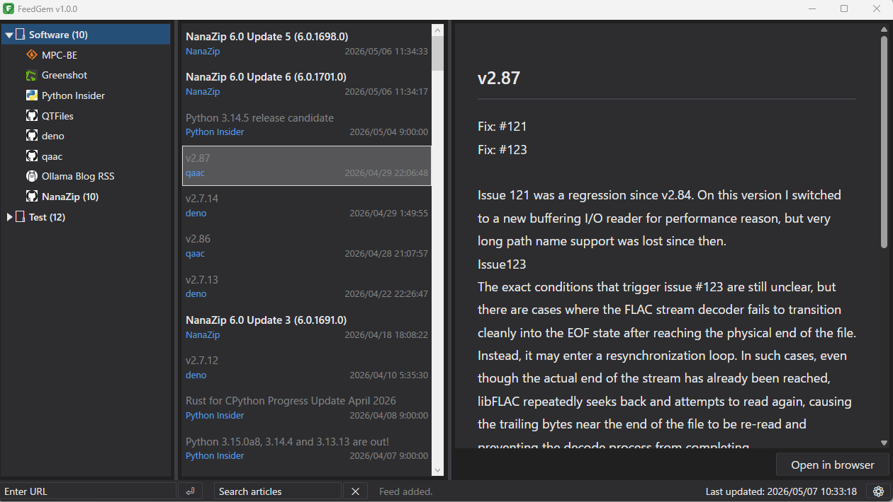
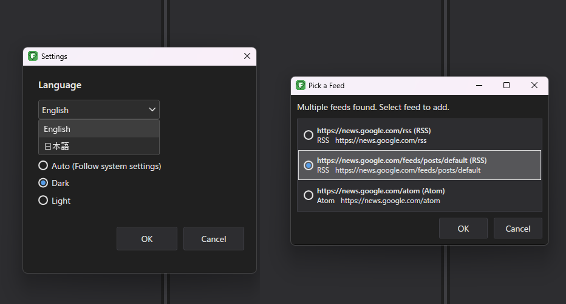

# FeedGem (Experimental / AI-Generated)
  

  
    
    

## 📌 Overview
**FeedGem** is a simple 3-pane RSS reader developed by an individual with no prior programming experience, built entirely through AI-assisted coding. It is a lightweight, portable application featuring multi-language support and a dark theme.

---

## ⚠️ Disclaimer
Please read the following carefully before using this software:

* **Experimental Project**: This application is intended for learning and experimental purposes. There is no guarantee of stability or completeness as a production-grade software.
* **No Warranty**: The author assumes no responsibility for any damages (data loss, PC malfunctions, etc.) incurred through the use of this software.
* **No Support**: As the developer is a non-programmer, individual bug fixes, feature requests, or technical support cannot be provided.
* **Open for Modification**: Feel free to modify, redistribute, or fork this project as you wish.

---

## 💻 Environment
- **OS**: Windows (x64 only)
- **Framework**: WPF
- **Prerequisites**: .NET 10.0 Runtime

---

## ✨ Key Features
- [x] **Portable**: No installation required.
- [x] **Multi-language**: English and Japanese built-in. Easily extendable to other languages via JSON files.
- [x] **Folder Management**: Organize feeds using single-level folders.
- [x] **Feed Discovery**: Automatically find RSS feeds from websites.
- [x] **Dark Theme**: Support for dark mode UI.
- [x] **OPML Support**: Import and export your feed lists.

### ⚠️ Current Limitations
- Keyboard shortcuts are not supported.
- Fine-grained customization and advanced settings are unavailable.

---

## 🛠 Libraries (NuGet)
This project utilizes the following libraries:

| Library | Purpose |
| :--- | :--- |
| `System.ServiceModel.Syndication` | Feed parsing |
| `Microsoft.Data.Sqlite` | Database management |
| `HtmlAgilityPack` | HTML parsing |
| `Microsoft.Web.WebView2` | Web content rendering |
| `H.NotifyIcon.Wpf` | System tray notifications |

---

## 📄 License
This project is licensed under the **MIT License**.
See the [LICENSE](./LICENSE) file for more details.

---

© 2026 htkzr80s

---

## 📌 概要
**FeedGem** は、プログラム未経験の個人がAIによるコーディングのみで作成した、3ペイン型のシンプルなRSSリーダーです。
ポータブル形式、多言語対応やダークテーマなど、基本的な機能を備えています。

---

## ⚠️ 注意事項（免責事項）
本プロジェクトをご利用いただく際は、以下の点にご注意ください。

* **実験的プロジェクト**: 本アプリは学習および実験を目的としており、実用的なソフトウェアとしての完成度は保証しておりません。
* **無保証**: 本ソフトウェアの使用により生じた損害（データの消失、PCの不具合等）について、作者は一切の責任を負いません。
* **サポート対象外**: 個別のバグ修正、機能追加、技術的な質問にはお応えできません。
* **自由な改変**: 改変、再配布、フォークなどは大歓迎です。ご自由にお使いください。

---

## 💻 動作環境
- **OS**: Windows (x64専用)
- **Framework**: WPF
- **必須コンポーネント**: .NET 10.0 ランタイム

---

## ✨ 主な機能
- [x] **ポータブル型**: インストール不要で動作可能
- [x] **多言語対応**: 日本語/英語を標準搭載。JSONファイルの追加で他言語拡張も可能
- [x] **フォルダ管理**: 1段階のフォルダによるフィード整理
- [x] **フィード探索**: Webサイトからフィードを自動検出
- [x] **ダークテーマ**: 目に優しい外観切り替え
- [x] **OPML対応**: フィードのインポートおよびエクスポートに対応

### ⚠️ 現在の制限事項（短所）
- キーボードショートカットには対応していません。
- 細かな詳細設定機能はありません。

---

## 🛠 使用ライブラリ (NuGet)
主要な機能を実現するために、以下のライブラリを使用しています。

| ライブラリ名 | 用途 |
| :--- | :--- |
| `System.ServiceModel.Syndication` | フィードの解析 |
| `Microsoft.Data.Sqlite` | データベース管理 |
| `HtmlAgilityPack` | HTML解析 |
| `Microsoft.Web.WebView2` | 記事表示用ブラウザ |
| `H.NotifyIcon.Wpf` | タスクトレイ通知 |

---

## 📄 ライセンス
本プロジェクトは **MIT License** の下で公開されています。
詳細はリポジトリ内の [LICENSE](./LICENSE) ファイルをご参照ください。

---

© 2026 htkzr80s
